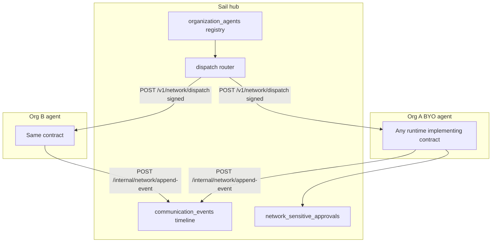

# Sail federated agent gateway

This document describes the **Sail-hub, per-organization agent** model implemented in the codebase. **OpenClaw is one possible `runtimeKind`**; the network contract is **runtime-agnostic**.

## Goals

- **Sail** remains the system of record for users, organizations, tasks, and in-app chat.
- Each organization may **register** a multi-tenant agent gateway (BYO or Sail-managed) that receives **dispatches** from Sail and posts **canonical communication events** back.
- **Sail-mediated** outbound email/messaging (when productized through this path) requires a **registered** agent or a managed instance—see product copy in [SPECIFICATION.md](SPECIFICATION.md).

## Architecture



## Data model

| Table | Purpose |
|-------|---------|
| `organization_agents` | One row per org: `runtime_kind`, `base_url`, `signing_secret`, `capability_manifest`, `status`, `managed_by`, heartbeat. |
| `communication_events` | Append-only canonical timeline (`dedupe_key` unique, `trace_id`, `thread_key`, `channel`, `direction`). |
| `network_sensitive_approvals` | Human approval queue for high-risk agent actions. |

Drizzle definitions: [shared/schema.ts](shared/schema.ts). Migration: [migrations/0009_federated_agent_gateway.sql](migrations/0009_federated_agent_gateway.sql).

## Authentication (HMAC)

**Agent → Sail** (JSON body):

- Headers: `X-Sail-Timestamp` (ms since epoch), `X-Sail-Signature` (hex HMAC-SHA256).
- Payload signed: `${timestamp}.${rawRequestBodyUtf8}` using the org’s `signing_secret`.
- Clock skew window: ±5 minutes.

**GET templates** (`/internal/network/templates?organizationId=`):

- Same headers; signed string is `${timestamp}.${organizationId}`.

**Sail → Agent** (`POST {baseUrl}/v1/network/dispatch`):

- Same HMAC scheme over the JSON dispatch envelope.

Implementations must use the **exact raw bytes** the signer used (Express preserves `req.rawBody` for JSON routes in [server/app.ts](server/app.ts)).

## Internal routes (agent callbacks)

| Method | Path | Purpose |
|--------|------|---------|
| POST | `/internal/network/append-event` | Ingest normalized message / delivery event. |
| POST | `/internal/network/task-sync` | Merge `external_refs` on a task (org-scoped). |
| POST | `/internal/network/heartbeat` | Liveness + set `last_heartbeat_at`. |
| GET | `/internal/network/templates` | Org-branded comms snippets (Sail-owned copy). |
| POST | `/internal/network/approval-requests` | Queue sensitive action for human review. |

Zod contracts: [server/network-agent/contract.ts](server/network-agent/contract.ts). HMAC helpers: [server/network-agent/hmac.ts](server/network-agent/hmac.ts).

## Hub API (authenticated)

### Platform admin

- `GET /api/admin/network/agents` — list registrations (secrets masked).
- `POST /api/admin/network/agents` — create row; returns **plaintext `signingSecret` once** when `activate: true` or always on create (see handler).
- `POST /api/admin/network/agents/:organizationId/rotate-secret` — new secret.
- `POST /api/admin/network/agents/:organizationId/ping` — `POST` dispatch `ping` to `baseUrl`.
- `PATCH /api/admin/network/agents/:id/status` — `pending` \| `active` \| `degraded` \| `disabled`.
- `GET /api/admin/network/approvals` — pending approvals; optional `?organizationId=`.
- `POST /api/admin/network/approvals/:id/resolve` — approve/reject.

### Organization members

- `GET /api/org/:organizationId/network-agent` — registration summary (masked secret).
- `PUT /api/org/:organizationId/network-agent` — upsert `runtimeKind`, `baseUrl`, capabilities; returns **new `signingSecret` only on first create**.
- `GET /api/org/:organizationId/network-events` — recent `communication_events` for that org.

## BYO vs Sail-managed

| Mode | Who runs the agent process | Who holds channel secrets | Upgrade burden |
|------|-----------------------------|---------------------------|----------------|
| **BYO** | Organization | Typically the org’s agent | Org |
| **Sail-managed** | Your infra (`managed_by = sail_managed`) | Your vault / process | You |

Document runbooks for TLS, firewall allowlists, and **minimum network API level** per `runtime_kind` as you certify runtimes (OpenClaw can be the first appendix).

## Dispatch envelope

```json
{
  "traceId": "string",
  "networkApiLevel": "1",
  "dispatchKind": "ping | task_update | template_push",
  "organizationId": "string",
  "payload": {}
}
```

Agents should echo `networkApiLevel` they support and reject incompatible levels.

## External-user UX

Sail-owned templates favor **recognizability**, **thread continuity**, **cold-inbound** handling, and **trust/opt-out** language—see [server/network-templates-service.ts](server/network-templates-service.ts) and the TS-native gateway plan’s UX section. Agents should **fetch** templates rather than hard-code org names.

## Failure modes

- **Agent down:** dispatch returns `no_active_agent` / `upstream_*`; registry row may be marked `degraded`. Sail must **never** route one org’s traffic to another org’s `base_url`.
- **Signature failure:** `401` on all internal routes.
- **Dedupe collision:** `append-event` returns `200` with `duplicate: true` when `dedupe_key` repeats.

## Reference agent stub

[reference-agent/](reference-agent/) contains a minimal HTTP server implementing `POST /v1/network/dispatch` for local ping tests.

## Relation to OpenClaw-only planning

If you standardize on **OpenClaw** as the first BYO runtime, set `runtime_kind = openclaw` and follow OpenClaw’s channel docs—but the **Sail contract stays the integration surface**.

## Appendix: Task email (Resend hub)

- **Outbound:** When a dashboard task’s `status` transitions to `open`, Sail sends a handoff email via Resend to the first `delivery_channels` entry with `kind: email`, if not already sent (see `history.kind = handoff_email_sent` or `external_refs` `resend` id prefix `handoff:`). `Reply-To` uses a signed local-part token (`reply-…`) so inbound can resolve `task_id` without guessing.
- **Inbound:** `POST /internal/webhooks/resend/inbound` verifies the Svix signature (`RESEND_WEBHOOK_SIGNING_SECRET`), handles `email.received`, loads the full MIME via `GET /emails/receiving/{id}`, maps the recipient local-part to a token, appends `communication_events` and task `history` (`email_reply_received`). Unknown or invalid tokens are logged and acknowledged without mutation.
- **Env:** See [README.md](README.md) (`RESEND_API_KEY`, outbound From in `server/email/from-address.ts`, `TASK_EMAIL_DOMAIN`, `TASK_EMAIL_ROUTE_SECRET`, `RESEND_WEBHOOK_SIGNING_SECRET`).

## Appendix: Outbound connectors (Telegram)

User-managed connectors reuse `channel_credentials` (`provider` = connector id, `credential_ref` = adapter-validated JSON). The registry and adapters live in [`server/connectors/`](server/connectors/).

- **Task handoff:** On `status` → `open`, [`sendConnectorHandoffsIfNeeded`](server/connectors/task-handoff-service.ts) sends via each send-capable adapter (today: **telegram** only) using the **task owner’s** active credential—not per-task addresses. Idempotency: `history.kind = handoff_telegram_sent`, `externalRefs.system = "telegram"`, prefix `handoff:` on external id.
- **Timeline:** Successful sends append `communication_events` (`channel: telegram`, `threadKey: telegram:{chatId}:{messageId}`).
- **Self-service:** `GET/PUT/PATCH/DELETE /api/connectors/mine/:provider`, `POST .../test`; dashboard **Connectors** pane.
- **Admin:** `POST /api/admin/members/:id/notify-test` with `channel: telegram` delegates to connector-service.
- **Env:** `TELEGRAM_BOT_TOKEN` (global bot); users store `chatId` only. Phone/Signal are catalog stubs (`coming_soon`) until adapters ship.
